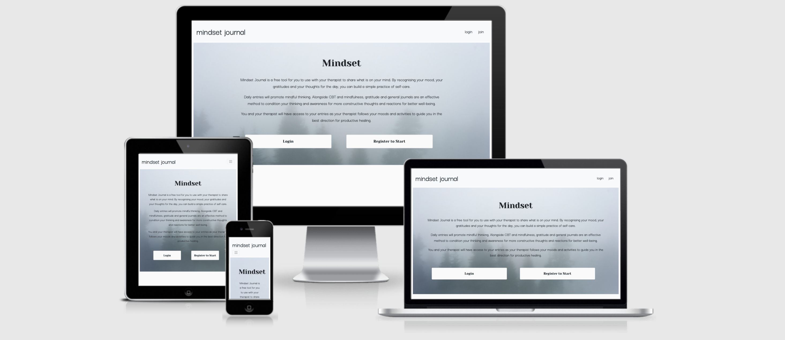

# Mindset Journal

## Objective:
---
Using Python, flask, MongoDB, create and app using CRUD. Mindset Journal is a gratitude journal based on recent requirements from a therapist/health coach. Mindset Journal provides an accessible viewpoint to journal 3 positive things every day, write notes or a journal entry and offer a public affirmation. The user will be able to privately access their entries with their username, they will have the option for their affirmations to be public. The user can read, update and delete their entries. The goal is to create a community with affirmations and to provide a tool for my therapist to give her clients to consistently collect three positive gratitudes a day. The gratitudes and journal entries can be referenced by the users at their appointment. 
[You can view the live project here](http://mindset-journal.herokuapp.com/homepage)

[Login Page](./static/readme-docs/login.preview.png)

---
## Contents 
---
[UX](#ux)
* Project Objectives 
* User Goals
* Business Goals
* User Requirements

[Planning & Design](#planning-and-design)
* Layout & Wireframes
* Colors
* Fonts

[Technologies](#technologies-used) 
  
[Features](#features)
  * Current
  * Future 

[Testing](#testing) 

[Bugs](#bugs)

[Deployment](#deployment) 
  * Method
  
[Credits](#credits)

# UX
### Project Objectives
Mindset is an accessible app for therapists and health coaches to use with their clients. It can also be used by anyone for their way to journal and practice gratitude and follow their entries over a period of time. The website provides privacy so no one other than the admin can access the entries. The secondary purpose of this project is to demonstrate my understanding of backend technologies using Python, Flask and MongoDB.

### User Goals 
---
As a potential user of Mindset Journal I want:
* I want to visit a modern and clean website.  
* I want to easily navigate the website.
* I want to record my diary entries and gratitudes.
* I want to be able to access my past entries and gratitudes
* I want the app to work on my phone and desktop.
* I want the app to feel inclusive and accessible.
* I want to know my therapist can see my entries. 
* I want the app to be simple so it is easy to use consistently for the benfit of my wellbeing practice.

### Business Goals
---
* The Mindset Journal app should be very user-friendly and efficient for busy people.
* The Mindset Journal must be approachable and inclusive to increase return users to use the diary and gratitude journal as part of their wellbing program. 
* The Mindset Journal should provide CTA's for a fluent flow of the site, to make an intuitive site.
* The Mindset Journal is accessible for anyone using the app with their therpaist, health coach or independently.
* The therapist has access to all entries to moniter their clients. 
* Users can only see their entries to ensure privacy for the other users. 
* The design will be neutral to feel inclusive to encourage people of all backgrounds and genders to use.
* Mindset app must work on mobile and desktop applications to ensure user will use the app consistently for their wellbeing practice. 

### User Requirements 
---
1) Responsive design for mobile/tablet/desktop.
2) Simple and intuitive layout and design of the website, UX is efficient.
3) Provides diary and gratitude entries input.
4) Allows user to edit their entries.
5) Allows user to delete unwanted entries.
6) Site works on a variety of browsers.
7) The design of the site is approachable and intuitive. 
8) User can login to their account to see only their entries. 
9) No other user other than admin can see other users' entries.

# Planning & Design

### Planning and Design
---
## Scope 

Mindset Journal is a site featuring clean and calming design elements and UX to provide a space to create and collect diary and gratitude entries for a wellbeing practice. The site provides users with a homepage, login, register pages, a personalised profile page, journal and gratitude pages and more. This app is simply designed as an accessible tool for users and their therapist. The user must be able to create diary and gratitude entries, edit them or delete them. The user is able to refer to past entries to see their growth as they progress with their habit of journaling and gratitudes. This is beneficial for the therapist to reflect upon to point their client in the right direction for their treatment. 

## Structure 

The layout is simple. Homepage, Register, Login, Write Journal, Edit journal, Journal, Write Gratitude, Edit Gratitude and Delete gratitude. Design is uniform to accomodate those with neurodiversity, stress and depression.
  
## Skeleton 

The Mindset Journal site was planned out with mockup wireframes using Balsamiq. They are as follow:
 
## Layout & Wireframes

#### Homepage       
* [Home desktop](/.static/wireframes/homepage.png )
​
#### Login
* [Home desktop](./static/wireframes/login.html.png)
​
#### Register
* [Home desktop](./static/wireframes/register.html.png)

#### Profile
* [Home desktop](./static/wireframes/profile.html.png)

#### Write Journal Entries
* [Home desktop](./static/wireframes/journal.html.png)
​
#### Edit Journal Entries
* [Home desktop](./static/wireframes/edit_journal.html.png)

#### Entry collection
* [Home desktop](./static/wireframes/entry_collection.html.png)

#### Write Gratitude Journal
* [Home desktop](./static/wireframes/gratitude.html.png)

#### Edit Gratitude Journal
* [Home desktop](./static/wireframes/edit_gratitude.html.png)

#### Gratitude Journal 
* [Home desktop](./static/wireframes/gratitude_collection.html.png)

### Colors

To create an inclusive site I chose calming colors that would be less influencial in a target demographic way and journals are more marketed to women and I wanted Mindset Journal to be attractive to everyone as the objective it to help people of all walks of life to practive mindfulness with journalling and gratitudes alongside therapy.

The colors I used are a natural grey/blue with some warmer neutral textures:

#82b0b4 - light grey blue to use to highlight text.

#0d1922 - a softer black with tones of blue for the majority of text and forms to create a visual contrast for better UX.

#fafafa - the classic warmer white color for the background and navbar to enhance contrast against the text and to be less harsh on the eyes. 

### Images

I collected images to use as accents across the site. I didn't want the app to look too cluttered or stimulating to distract the user from the main purpose of the app. The images I use bring a complementary warmth the the color scheme with gold and warm beige. I focused on finding images with natural elements for a soft sensory effect to promote a calmness for users on the site. I used texture close-ups of wool, linen and paintings. 

### Fonts

For a modern, editorial effect, I looked at clean and effective sites and was incluenced a lot by Vogue.com. I used a cursive bigger font called Yeseva One for most headings to add some weight to the design. With most of the structure of the site's forms being an almost navy-black, I wanted the main font to be an elegant and modern font to soften the design and maintain a visual balance, for this I sued Darker Grotesque from Google Fonts. Where I needed a little more definition on the profile page for the journal and gratitude buttons, I used Gill Sans as it looks a little stronger against a background image.

# Technologies

* [HTML5](https://en.wikipedia.org/wiki/HTML5) 

* [CSS3](https://en.wikipedia.org/wiki/CSS) for site styling

* [Bootstrap](https://getbootstrap.com/) for navbar and page layouts.

* [Javascript](https://www.javascript.com/) for interactive styling elements

* [JQuery](https://jquery.com/) a javascript library.
 
* [Python](https://www.python.org/) for backend development.

* [Flask](https://en.wikipedia.org/wiki/Flask_(web_framework)) a python framework.

* [MongoDB](https://www.mongodb.com/) for a custom database to record journal and gratitude entries and users. 

* [Google Fonts](https://fonts.google.com/) for the Yeseva One and Darker Grotesque fonts. 

* [Git](https://git-scm.com/)

* [Gitpod](https://www.gitpod.io/) for site development 

* [Heroku](https://heroku.com/) for site deployment.

* [Techsini](https://techsini.com/multi-mockup/index.php) for mock-up mobile/tablet/desktop images

* [Balsamiq](https://balsamiq.com) for wireframes.

# Features
* Navigation bar
* Brand Logo
* Responsive elements for Desktop, tablet and mobile.
* Intuitive journal and gratitude forms forms
* Login/Logout
* Register Username
* Call to action buttons
* JINJA2 loops
* Python backend functionality
* Custom MongoDB database for entries and users
* Create/Read/Update/Delete functionality
* Images 

# Testing

[Development Testing](./static/readme-docs/mindsettests.pdf)
[Development Testing](./static/readme-docs/Mindset-testing.pdf)
* I intermittently used [Google Dev Tools](https://developers.google.com/web/tools/chrome-devtools) to double check coding and debugging.
*  Validation testing to double check coding accuracy was done with:
  1) [W3S CSS Validator](https://jigsaw.w3.org/css-validator/) 
  2) [W3S Html Validator](https://validator.w3.org/)  
  3) [Javascript Validator](https://beautifytools.com/javascript-validator.php)
  
 * Sent friends and family link to site to check on their variety of devices including:
		* Apple iPhone 6, XS, 12
		* Apple iPad 5th Generation
   		* Samsung Galaxy
		* Apple MacBook Pro
		* Apple MacBook Air
        * Windows Operated Laptop/PC
        * Chrome
        * Safari
        * Internet Explorer
        * Firefox
# Bugs
# Deployment
# Credits